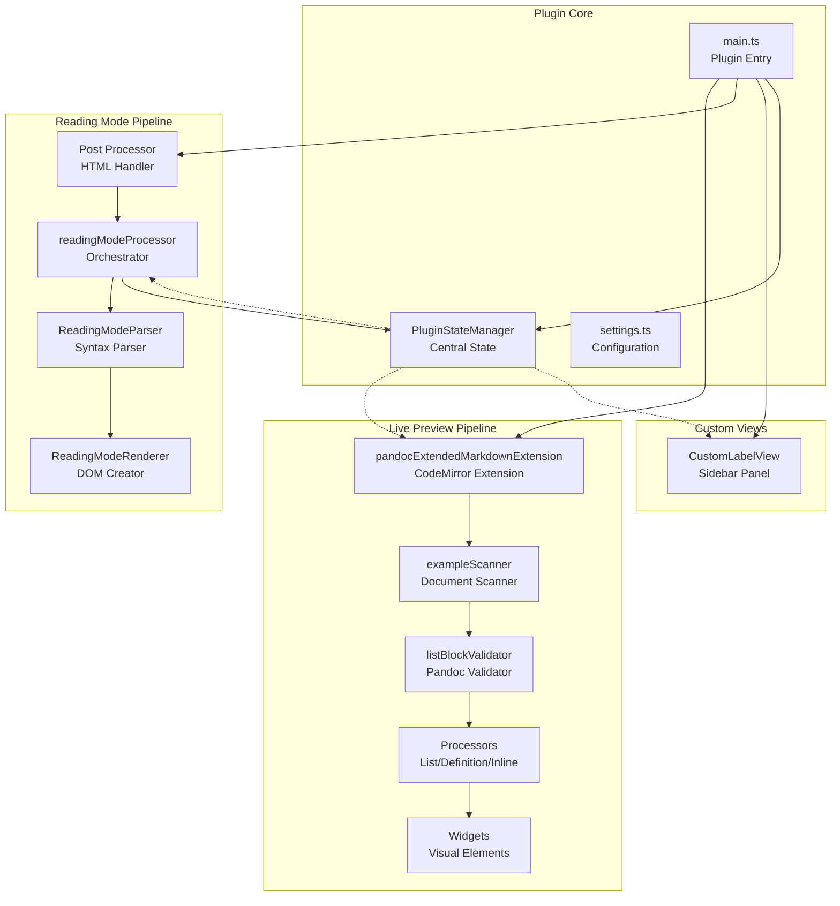
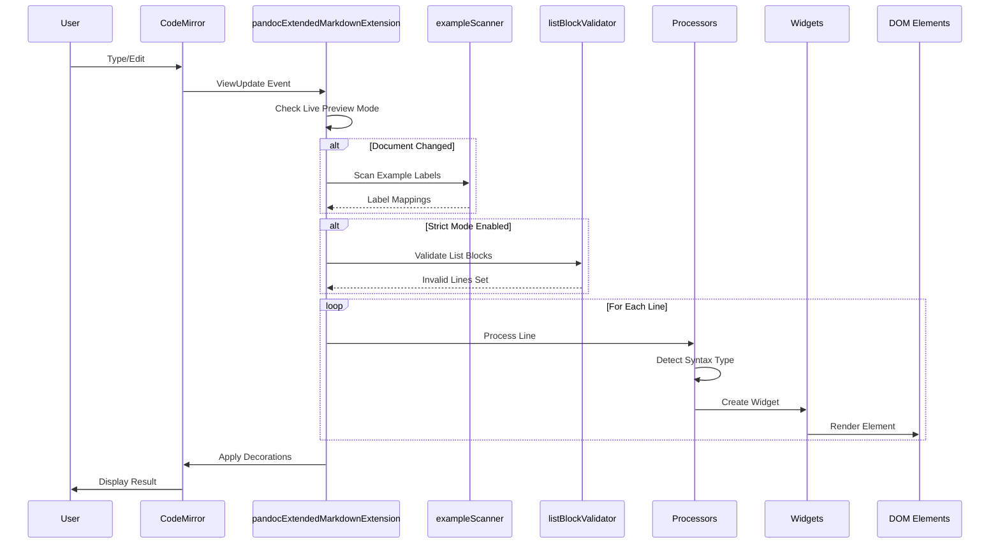
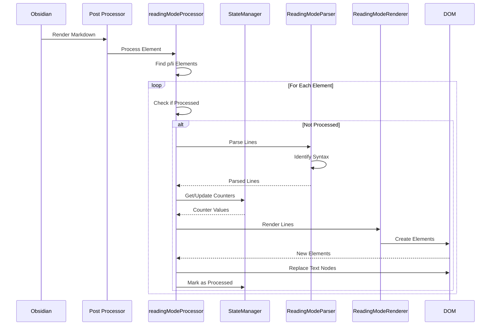
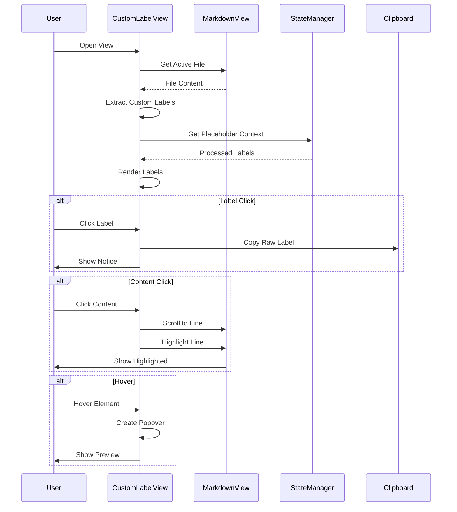
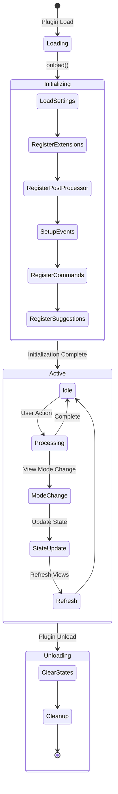
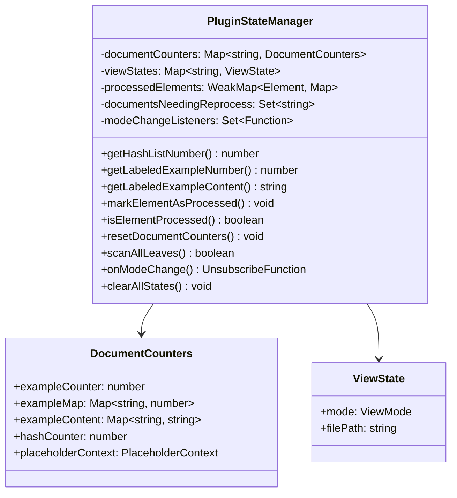
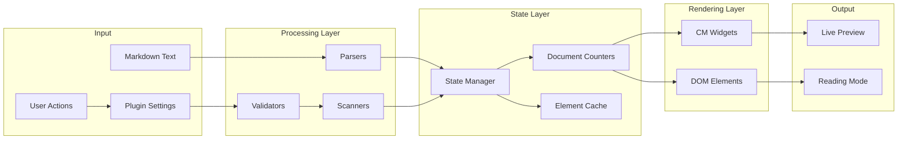

# Pandoc Extended Markdown Plugin Architecture

This document provides a comprehensive technical overview of the pandoc-extended-markdown-plugin architecture. It details the rendering pipelines, state management, and component interactions to facilitate debugging and feature development.

## Table of Contents

1. [Project Structure](#project-structure)
2. [Architecture Overview](#architecture-overview)
3. [Live Preview Rendering Pipeline](#live-preview-rendering-pipeline)
4. [Reading Mode Rendering Pipeline](#reading-mode-rendering-pipeline)
5. [Plugin Lifecycle & State Management](#plugin-lifecycle--state-management)
6. [Data Flow Diagrams](#data-flow-diagrams)
7. [Component Responsibilities](#component-responsibilities)
8. [Architectural Protocols](#development-guidelines)

## Project Structure

```
pandoc-lists-plugin/
├── src/                                   # Source code directory
│   ├── main.ts                           # Plugin entry point, manages mode detection and state
│   ├── settings.ts                       # Settings interface and settings tab implementation
│   ├── pandocValidator.ts                # Validates and formats lists to Pandoc standards
│   ├── listAutocompletion.ts             # Handles Enter/Tab/Shift-Tab key bindings for lists
│   ├── exampleReferenceSuggest.ts       # Autocomplete suggestion system for (@references)
│   ├── customLabelReferenceSuggest.ts    # Autocomplete suggestions for {::references} with rendered preview
│   ├── constants.ts                      # Centralized constants for magic values and CSS classes
│   ├── patterns.ts                       # Optimized regex patterns with caching
│   ├── state/                            # State management architecture
│   │   └── pluginStateManager.ts        # Unified state manager for all plugin state
│   ├── decorations/                      # CodeMirror decorations for live preview
│   │   ├── pandocExtendedMarkdownExtension.ts # Main orchestrator for live preview rendering
│   │   ├── widgets/                      # CodeMirror widget implementations
│   │   │   ├── listWidgets.ts           # Widgets for list markers (fancy, hash, example)
│   │   │   ├── definitionWidget.ts      # Widget for definition list bullets
│   │   │   ├── referenceWidget.ts       # Widget for example references
│   │   │   ├── formatWidgets.ts         # Widgets for super/subscripts
│   │   │   ├── customLabelWidget.ts     # Widget for custom label lists and references
│   │   │   └── index.ts                 # Re-exports all widgets
│   │   ├── processors/                   # Decoration processing logic
│   │   │   ├── listProcessors.ts        # Process hash, fancy, and example lists
│   │   │   ├── definitionProcessor.ts   # Process definition lists, terms, and paragraphs
│   │   │   ├── inlineFormatProcessor.ts # Process inline formats (references, super/subscripts)
│   │   │   ├── customLabelProcessor.ts  # Process custom label lists and references
│   │   │   └── index.ts                 # Re-exports all processors
│   │   ├── validators/                   # Validation utilities
│   │   │   └── listBlockValidator.ts    # Validates list blocks for strict Pandoc mode
│   │   └── scanners/                     # Document scanning utilities
│   │       ├── exampleScanner.ts        # Scans for example labels and duplicates
│   │       └── customLabelScanner.ts    # Scans for custom labels and validates blocks
│   ├── parsers/                          # Parsing and processing logic
│   │   ├── readingModeParser.ts         # Parses markdown text, identifies Pandoc syntax
│   │   ├── fancyListParser.ts           # Parses fancy lists (A., B., i., ii., #.)
│   │   ├── exampleListParser.ts         # Parses example lists with (@label) syntax
│   │   ├── definitionListParser.ts      # Parses definition lists (: and ~ markers)
│   │   ├── superSubParser.ts            # Parses superscripts (^) and subscripts (~)
│   │   ├── customLabelListParser.ts     # Parses custom label lists with {::LABEL} syntax
│   │   └── readingModeProcessor.ts      # Thin orchestration layer for reading mode
│   ├── renderers/                        # Rendering logic (DOM creation)
│   │   └── readingModeRenderer.ts       # Creates DOM elements from parsed markdown
│   ├── types/                            # TypeScript type definitions
│   │   ├── processorConfig.ts           # Configuration injection interface
│   │   ├── listTypes.ts                 # List-related interfaces and types
│   │   ├── obsidian-extended.ts         # Type definitions for Obsidian's internal APIs
│   │   └── settingsTypes.ts             # Settings interface and default settings
│   ├── views/                            # Custom Obsidian views
│   │   └── CustomLabelView.ts           # Sidebar view for displaying custom label lists
│   ├── utils/                            # Utility functions
│   │   ├── errorHandler.ts              # Error handling utilities with error boundaries
│   │   ├── placeholderProcessor.ts      # Auto-numbering processor for (#placeholder) syntax
│   │   ├── listHelpers.ts               # List conversion utilities (roman numerals, letters)
│   │   ├── listMarkerDetector.ts        # Detects list types and determines next markers
│   │   └── listRenumbering.ts           # Handles automatic list renumbering
├── __mocks__/                            # Jest mock implementations
│   ├── obsidian.ts                      # Mocks Obsidian API for testing
│   └── codemirror.ts                    # Mocks CodeMirror modules for testing
├── tests/                                # Test files
│   ├── customLabelAutocompletion.spec.ts # Tests for custom label auto-completion
│   ├── customLabelAutoNumbering.spec.ts  # Tests for custom label auto-numbering
│   ├── customLabelList.spec.ts          # Tests for custom label list functionality
│   ├── customLabelMultiLine.spec.ts     # Tests for multi-line custom label blocks
│   ├── customLabelNestedWidget.spec.ts  # Tests for nested custom label widgets
│   ├── customLabelPlaceholder.spec.ts   # Tests for placeholder numbering and context
│   ├── customLabelReadingMode.spec.ts   # Tests for custom labels in reading mode
│   ├── customLabelSuggestion.spec.ts    # Tests for custom label reference suggestions
│   ├── customLabelView.spec.ts          # Tests for custom label sidebar view
│   ├── definitionListParser.spec.ts     # Tests for definition list parsing
│   ├── exampleListParser.spec.ts        # Tests for example list parsing
│   ├── fancyListParser.spec.ts          # Tests for fancy list parsing
│   ├── listAutocompletion.spec.ts       # Tests for list auto-completion
│   ├── listIndentation.spec.ts          # Tests for list indentation handling
│   └── toggleDefinitionStyles.spec.ts   # Tests for definition style toggling
├── .github/                              # GitHub specific files
│   └── workflows/
│       └── release.yml                  # GitHub Actions workflow for automated releases
├── main.js                              # Compiled plugin code (build output)
├── manifest.json                         # Plugin metadata (id, name, version, minAppVersion)
├── versions.json                         # Version compatibility mapping for updates
├── styles.css                            # Main plugin styles for all list types
├── package.json                          # Node.js dependencies and scripts
├── tsconfig.json                         # TypeScript compiler configuration
├── jest.config.js                        # Jest testing framework configuration
├── esbuild.config.mjs                    # Build configuration for bundling the plugin
├── .gitignore                            # Specifies files to exclude from version control
├── LICENSE                               # MIT License file
├── README.md                             # User documentation
└── ARCHITECTURE.md                       # This technical documentation
```

## Architecture Overview

The plugin operates in two distinct rendering modes, each with its own pipeline:

1. **Live Preview Mode**: Real-time syntax transformation using CodeMirror 6 decorations
2. **Reading Mode**: Post-processing of rendered HTML using DOM manipulation

Both modes share a common state management system through `PluginStateManager`.

Additionally, the plugin provides a **Custom Label View** - a sidebar panel that displays all custom label lists from the current document in an organized, interactive format.



## Live Preview Rendering Pipeline

### Overview
The live preview system transforms markdown syntax in real-time as users type, using CodeMirror 6's decoration system to overlay visual elements without modifying the underlying text.

### Detailed Flow



### Key Components

#### 1. pandocExtendedMarkdownExtension (Orchestrator)
- **Location**: `src/decorations/pandocExtendedMarkdownExtension.ts`
- **Role**: Main coordinator for live preview rendering
- **Responsibilities**:
  - Detects live preview mode state
  - Triggers document scanning when content changes
  - Manages decoration building and application
  - Handles cursor-aware rendering (hides widgets when cursor is inside)

#### 2. Document Scanners
- **exampleScanner** (`src/decorations/scanners/exampleScanner.ts`): Pre-processes example labels for consistent numbering
- **customLabelScanner** (`src/decorations/scanners/customLabelScanner.ts`): 
  - Scans custom labels with placeholder support
  - Validates block structure in strict mode
  - Smart reset detection: only resets PlaceholderContext when placeholder order changes
  - Two-pass scanning: detects placeholders first, then processes labels
  - Duplicate detection: tracks duplicate labels and their first occurrence
- **Output**:
  ```typescript
  interface ExampleScanResult {
    exampleLabels: Map<string, number>        // label -> number
    exampleContent: Map<string, string>       // label -> content
    exampleLineNumbers: Map<number, number>   // line -> example number
    duplicateLabels: Map<string, number>      // duplicate -> first line
    duplicateLabelContent: Map<string, string> // duplicate -> original content
  }
  
  interface CustomLabelScanResult {
    customLabels: Map<string, string>         // processed label -> content
    rawToProcessed: Map<string, string>       // raw label -> processed label
    duplicateLabels: Set<string>              // labels that appear more than once
    duplicateLineInfo?: Map<string, { firstLine: number; firstContent: string }> // duplicate label -> first occurrence info
    placeholderContext: PlaceholderContext    // context for auto-numbering
  }
  ```

#### 3. Processors
Transform markdown syntax into decorations:
- **List Processors**: Hash lists (#.), fancy lists (A., i.), example lists ((@))
- **Definition Processors**: Terms, items (~/:), indented paragraphs
- **Inline Processors**: References, superscripts, subscripts
- **Custom Label Processor**: Custom label lists ({::LABEL}) with:
  - Auto-numbering support for (#placeholder) syntax
  - Three-level display system based on cursor position
  - Selective placeholder expansion (only expands placeholder under cursor)

#### 4. Widgets
Visual representations that replace markdown syntax:
- **HashListMarkerWidget**: Auto-numbered list items
- **FancyListMarkerWidget**: Styled alphabetic/roman markers
- **ExampleListMarkerWidget**: Numbered examples with tooltips
- **DefinitionBulletWidget**: Bullet points for definitions
- **SuperscriptWidget/SubscriptWidget**: Formatted text elements
- **CustomLabelMarkerWidget**: Custom label list markers
- **CustomLabelReferenceWidget**: Custom label references with tooltips
- **CustomLabelPartialWidget**: Partial rendering for bracket/parenthesis parts
- **CustomLabelPlaceholderWidget**: Styled placeholder numbers with dotted underline
- **CustomLabelProcessedWidget**: Processed form display for semi-expanded state
- **CustomLabelInlineNumberWidget**: Atomic inline number replacements for selective expansion
- **DuplicateCustomLabelWidget**: Duplicate custom label warning with error styling
- **DuplicateExampleLabelWidget**: Duplicate example label warning with error styling

### Trigger Events
- Document changes
- Viewport changes (scrolling)
- Selection changes (cursor movement)
- Live preview mode toggle

## Reading Mode Rendering Pipeline

### Overview
The reading mode system post-processes HTML after Obsidian's markdown renderer, transforming Pandoc syntax that wasn't handled by the default parser.

### Detailed Flow



### Key Components

#### 1. readingModeProcessor (Orchestrator)
- **Location**: `src/parsers/readingModeProcessor.ts`
- **Role**: Coordinates parsing, state management, and rendering
- **Process**:
  1. Selects paragraph and list item elements
  2. Validates against markdown source
  3. Prevents duplicate processing
  4. Manages render context creation

#### 2. ReadingModeParser
- **Location**: `src/parsers/readingModeParser.ts`
- **Purpose**: Identifies and parses Pandoc syntax
- **Capabilities**:
  - Line-by-line parsing with context awareness
  - Multiple syntax type detection
  - Metadata extraction for each syntax type

#### 3. Specialized Parsers
Each parser handles specific syntax patterns:
- **fancyListParser**: Alphabetic and roman numeral lists
- **exampleListParser**: Example lists with labels
- **definitionListParser**: Definition terms and items
- **superSubParser**: Superscript and subscript formatting
- **customLabelListParser**: 
  - Custom label lists with {::LABEL} syntax
  - Two-pass processing: scans all labels first to build context, then processes elements
  - Handles multi-placeholder references like P(#a),(#b)

#### 4. ReadingModeRenderer
- **Location**: `src/renderers/readingModeRenderer.ts`
- **Purpose**: Creates DOM elements from parsed data
- **Features**:
  - Maintains line breaks and formatting
  - Adds tooltips for references
  - Handles nested markdown in definitions

## Custom Label View

### Overview
The Custom Label View provides an interactive sidebar panel that displays all custom label lists (`{::LABEL}` syntax) from the active markdown document. It offers quick navigation and reference capabilities for documents with extensive custom labeling.

### Features
- **Two-column layout**: Displays labels and their associated content
- **Smart truncation**: Labels limited to 5 characters, content to 3 lines
- **Interactive elements**:
  - Label click: Copies raw label syntax to clipboard
  - Content click: Navigates to label position in editor with visual highlight
  - Hover previews: Shows full content with rendered math
- **Auto-refresh**: Updates when switching files or editing content
- **Error boundaries**: Safe operation with fallback for errors

### Implementation Details



### Key Methods
- **`extractCustomLabels()`**: Parses document for custom label syntax
- **`renderLabels()`**: Creates DOM structure with interactive elements
- **`highlightLine()`**: Applies visual highlight using editor selection
- **`setupHoverPreview()`**: Manages popover lifecycle for previews
- **`withErrorBoundary()`**: Wraps operations for safe execution

## Plugin Lifecycle & State Management

### Lifecycle Sequence



### PluginStateManager Architecture

The central state management system maintains consistency across all plugin operations:



### State Management Features

#### Document-Specific State
- Isolated counters per document
- Label-to-number mappings for cross-references
- Content caching for tooltips
- Reprocessing flags for efficient updates
- PlaceholderContext persistence across mode switches

#### View Mode Tracking
- Per-leaf mode detection (reading/live/source)
- Mode transition detection
- Event notification system
- Batch processing optimization

#### Memory Management
- WeakMap for automatic garbage collection
- Explicit cleanup on unload
- Lazy initialization of counters
- Strategic state clearing on mode changes

## Data Flow Diagrams

### Overall Data Flow



## Component Responsibilities

### Core Components

| Component | Primary Responsibility | Key Interfaces |
|-----------|----------------------|----------------|
| `main.ts` | Plugin lifecycle management | `onload()`, `onunload()`, event registration |
| `pluginStateManager` | Centralized state coordination | Counter management, mode tracking, event dispatch |
| `settings.ts` | User configuration | Settings UI, preference persistence |
| `pandocValidator.ts` | Pandoc compliance validation | Format checking, auto-formatting |
| `listAutocompletion.ts` | Smart list continuation | Enter/Tab/Shift-Tab key handling, uses utility modules |
| `CustomLabelView.ts` | Custom label sidebar view | Label display, navigation, clipboard operations |

### Live Preview Components

| Component | Responsibility | Input | Output |
|-----------|---------------|-------|--------|
| `pandocExtendedMarkdownExtension` | Orchestration | ViewUpdate events | Decorations |
| `exampleScanner` | Label preprocessing | Document text | Label mappings |
| `listBlockValidator` | Strict mode validation | Document lines | Invalid line set |
| `processors/*` | Syntax processing | Line text, context | Decoration specs |
| `widgets/*` | Visual rendering | Widget data | DOM elements |

### Reading Mode Components

| Component | Responsibility | Input | Output |
|-----------|---------------|-------|--------|
| `readingModeProcessor` | Orchestration | HTML elements | Modified DOM |
| `ReadingModeParser` | Syntax identification | Text content | Parsed lines |
| `*Parser` (specialized) | Pattern matching | Line text | Structured data |
| `ReadingModeRenderer` | DOM generation | Parsed data | HTML elements |