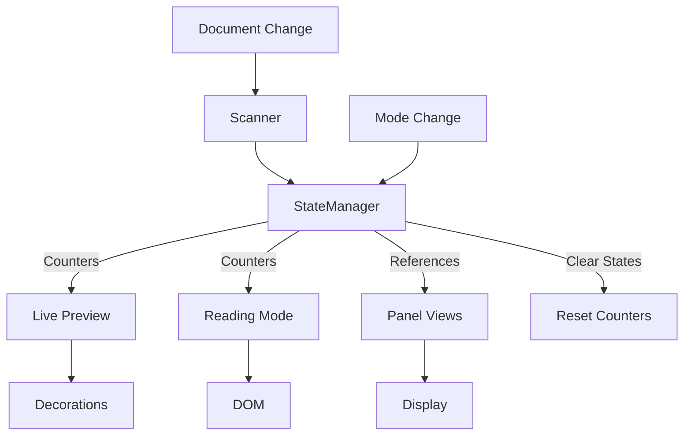

# Pandoc Extended Markdown Plugin Architecture

> Comprehensive technical documentation for the pandoc-extended-markdown plugin. This document helps developers understand existing implementations, debug issues, and extend functionality without duplicating code.

## Table of Contents

1. [Overview](#overview)
2. [Core Architecture](#core-architecture)
3. [Component Inventory](#component-inventory)
4. [Processing Pipeline Details](#processing-pipeline-details)
5. [Implementation Patterns](#implementation-patterns)
6. [Extension Guide](#extension-guide)

## Overview

This plugin extends Obsidian's markdown rendering to support Pandoc's extended syntax. It operates in two distinct modes with shared state management:

- **Live Preview Mode**: Real-time syntax transformation using CodeMirror 6 decorations
- **Reading Mode**: Post-processing of rendered HTML using DOM manipulation

### Supported Syntax

| Syntax Type | Examples | Implementation |
|-------------|----------|----------------|
| **Fancy Lists** | `A.`, `i.`, `(a)` | FancyListProcessor |
| **Hash Lists** | `#.` auto-numbering | HashListProcessor |
| **Example Lists** | `(@label)` with references | ExampleListProcessor |
| **Custom Labels** | `{::LABEL}` with placeholders | CustomLabelProcessor |
| **Definition Lists** | `: definition`, `~ definition` | DefinitionProcessor |
| **Superscript** | `^text^` with escaped spaces | SuperscriptProcessor |
| **Subscript** | `~text~` with escaped spaces | SubscriptProcessor |

## Core Architecture

### Design Principles

1. **Two-Phase Processing Pipeline**
   - Phase 1: Structural (block-level) processing
   - Phase 2: Inline (content) processing
   - Clean separation prevents interference between processors

2. **Base Class Hierarchy**
   - `BaseWidget`: Common widget functionality (DOM creation, events, lifecycle)
   - `BaseStructuralProcessor`: Shared structural processor logic (cursor detection, decorations, context)
   - `BasePanelModule`: Shared panel logic (state, updates, rendering)
   - Reduces duplication, ensures consistency

3. **Centralized Configuration**
   - Constants organized in modular structure:
     - `/core/constants.ts`: Main index file (354 lines)
     - `/core/constants/listConstants.ts`: LIST_MARKERS, LIST_TYPES, INDENTATION (35 lines)
     - `/core/constants/cssConstants.ts`: CSS_CLASSES, COMPOSITE_CSS, DECORATION_STYLES (130 lines)
   - All patterns in `ListPatterns` class (`/shared/patterns.ts`)
   - All types in `/shared/types/` directory

4. **State Management**
   - Document-specific: PluginStateManager
   - Processing artifacts: ProcessingContext
   - User preferences: Settings

5. **Error Handling**
   - Centralized error handling with `errorHandler.ts`
   - `withErrorBoundary()` for synchronous operations
   - `withAsyncErrorBoundary()` for async operations
   - Consistent error context and recovery patterns

6. **Code Quality Standards**
   - Maximum 400 lines per file
   - Maximum 50 lines per function
   - Import order: External → Types → Constants → Patterns → Utils → Internal
   - All hardcoded values in constants
   - Proper TypeScript types (no `any` without justification)

### Architectural Patterns

| Pattern | Purpose | Implementation |
|---------|---------|----------------|
| **Template Method** | Standardize widget lifecycle | BaseWidget.toDOM() |
| **Strategy** | Select processor per syntax | Processor.canProcess() |
| **Observer** | React to mode changes | StateManager.onModeChange() |
| **Registry** | Extensible content processing | ContentProcessorRegistry |
| **Chain of Responsibility** | Process lines sequentially | ProcessingPipeline |

## Component Inventory

### Live Preview Components

#### Structural Processors (`/live-preview/pipeline/structural/`)

All structural processors extend `BaseStructuralProcessor` which provides:
- `isCursorInMarker()`: Check if cursor is within marker range
- `isInvalidInStrictMode()`: Validate strict mode compliance
- `createLineDecoration()`: Create standard line decorations
- `createContentMarkDecoration()`: Create content area decorations
- `createMarkerReplacement()`: Create marker replacement widgets
- `createContentRegion()`: Define regions for inline processing
- `setListContext()`: Update list context for continuation detection
- `processStandardList()`: Template method for standard list processing

| Processor | Priority | Purpose | Triggers On | Extends |
|-----------|----------|---------|-------------|---------|

* CustomLabelProcessor is modularized into `/customLabel/` subdirectory for better organization
| **HashListProcessor** | 10 | Auto-number `#.` lists | `^\s*#\.` | BaseStructuralProcessor |
| **CustomLabelProcessor*** | 15 | Process `{::LABEL}` markers | `^\s*\{::` | StructuralProcessor |
| **FancyListProcessor** | 20 | Letter/Roman lists | `^\s*[A-Za-z0-9]+[.)]` | BaseStructuralProcessor |
| **DefinitionProcessor** | 20 | Definition list items | `^:\s` or `^~\s` | StructuralProcessor |
| **ExampleListProcessor** | 30 | Example lists `(@label)` | `^\s*\(@` | BaseStructuralProcessor |
| **StandardListProcessor** | 40 | Standard markdown lists | `^\s*[-*+]` or `^\s*\d+\.` | StructuralProcessor |
| **ListContinuationProcessor** | 100 | Indented continuations | Indented non-empty lines | StructuralProcessor |

#### Inline Processors (`/live-preview/pipeline/inline/`)

| Processor | Priority | Processes | Regions |
|-----------|----------|-----------|---------|
| **ExampleReferenceProcessor** | 10 | `(@ref)` → `(number)` | list-content, definition-content |
| **SuperscriptProcessor** | 20 | `^text^` → superscript | list-content, definition-content |
| **SubscriptProcessor** | 20 | `~text~` → subscript | list-content, definition-content |
| **CustomLabelReferenceProcessor** | 40 | `{::ref}` → processed | list-content, definition-content |

#### Widgets (`/live-preview/widgets/`)

All widgets extend `BaseWidget` which provides:
- `toDOM()`: Template method for rendering
- `applyStyles()`: CSS class application
- `setContent()`: Content insertion
- `setupClickHandler()`: Cursor positioning
- `destroy()`: Cleanup with AbortController

| Widget | Extends | Renders |
|--------|---------|---------|
| **FancyListMarkerWidget** | BaseWidget | `A.`, `i.`, `(a)` markers |
| **HashListMarkerWidget** | BaseWidget | Auto-numbered markers |
| **ExampleListMarkerWidget** | BaseWidget | `(@label)` → `(n)` with tooltip |
| **DuplicateExampleLabelWidget** | BaseWidget | Error styling for duplicates |
| **CustomLabelMarkerWidget** | BaseWidget | `{::LABEL}` processed markers |
| **CustomLabelPartialWidget** | BaseWidget | Partial label rendering |
| **CustomLabelPlaceholderWidget** | BaseWidget | `#a` → number |
| **CustomLabelProcessedWidget** | BaseWidget | Fully processed labels |
| **CustomLabelInlineNumberWidget** | BaseWidget | Inline number replacements |
| **CustomLabelReferenceWidget** | BaseWidget | `{::ref}` with hover preview |
| **DuplicateCustomLabelWidget** | BaseWidget | Error styling for duplicates |
| **DefinitionBulletWidget** | BaseWidget | Definition list bullets |
| **ExampleReferenceWidget** | BaseWidget | `(@ref)` → `(n)` with hover |
| **SuperscriptWidget** | BaseWidget | Superscript formatting |
| **SubscriptWidget** | BaseWidget | Subscript formatting |

### Reading Mode Components

#### Parsers (`/reading-mode/parsers/`)

| Parser | Detects | Transforms |
|--------|---------|------------|
| **fancyListParser** | Letter/Roman markers | Adds proper styling |
| **exampleListParser** | `(@label)` syntax | Numbers with tooltips |
| **definitionListParser** | `:` and `~` definitions | Styled definition lists |
| **customLabelListParser** | `{::LABEL}` syntax | Two-pass processing |
| **superSubParser** | `^` and `~` formatting | Super/subscript elements |

### Panel Modules (`/views/panels/modules/`)

All panels extend `BasePanelModule` which provides:
- Lifecycle management (activate/deactivate/update)
- State management (containerEl, activeView, abortController)
- Context building (example labels, custom labels)
- Base update flow

| Module | ID | Displays |
|--------|----|---------|
| **ExampleListPanelModule** | example-lists | Three columns: number, label, content |
| **CustomLabelPanelModule** | custom-labels | Two columns: processed label, content |
| **DefinitionListPanelModule** | definition-lists | Two columns: term, definitions |
| **FootnotePanelModule** | footnotes | Two columns: footnote label, rendered content |

### Editor Extensions

#### List Autocompletion (`/editor-extensions/listAutocompletion/`)

**Modular architecture for keyboard handling:**

```
listAutocompletion/
├── index.ts               # Main export, combines all handlers
├── types.ts               # All interfaces and types
├── handlers/
│   ├── enterHandler.ts    # Enter key logic
│   ├── tabHandler.ts      # Tab/Shift+Tab logic
│   ├── shiftHandlers.ts   # Shift+Enter logic
│   ├── emptyListHandler.ts    # Empty list handling
│   ├── listItemHandler.ts     # New list item creation
│   └── continuationHandler.ts # Continuation lines
└── utils/
    ├── lineInfo.ts        # Line information utilities
    ├── markerDetection.ts # List marker detection
    ├── indentation.ts     # Indentation utilities
    └── continuationUtils.ts # Continuation helpers
```

| Component | Purpose | Max Lines |
|-----------|---------|----------|
| **handlers/** | Event-specific keyboard handlers | 135 |
| **utils/** | Reusable utility functions | 83 |
| **types.ts** | All TypeScript interfaces | 52 |
| **index.ts** | Factory function and exports | 23 |

### Shared Components

#### Extractors (`/shared/extractors/`)

| Extractor | Returns | Used By |
|-----------|---------|---------|
| **exampleListExtractor** | ExampleListItem[] | Panels, context building |
| **customLabelExtractor** | CustomLabel[] | Panels, processing |
| **definitionListExtractor** | DefinitionListItem[] | Definition panel |
| **footnoteExtractor** | FootnotePanelItem[] | Footnote panel, cursor positioning |

#### Utilities (`/shared/utils/`)

| Utility | Purpose | Used For |
|---------|---------|----------|
| **errorHandler** | Centralized error handling | All try-catch blocks |
| **mathRenderer** | LaTeX → Unicode conversion | Panel displays |
| **hoverPopovers** | Hover preview creation | References, tooltips |
| **contentTruncator** | Smart content truncation | Panel displays |
| **listHelpers** | List manipulation | Autocompletion |
| **placeholderProcessor** | Process `#a`, `#b` | Custom labels |
| **cursorUtils** | Cursor position calculations | Inline processors |
| **contextUtils** | Reference context building | Inline processors, widgets |

#### Reading Mode Utilities (`/reading-mode/utils/`)

| Utility | Purpose | Used For |
|---------|---------|----------|
| **domUtils** | DOM traversal helpers | Reading mode parsers |

## Processing Pipeline Details

### Live Preview Processing Flow

#### Phase 0: Context Building
```typescript
1. Code Region Detection
   - Identify code blocks: ```...```
   - Identify inline code: `...`
   - Mark regions to skip

2. Document Scanning
   - Extract example labels → Map<label, number>
   - Extract custom labels → Map<label, processed>
   - Skip code regions

3. Validation (Strict Mode)
   - Check Pandoc compliance
   - Mark invalid lines

4. State Retrieval
   - Get hash counter
   - Get definition state
   - Get placeholder context
```

#### Phase 1: Structural Processing
```typescript
For each line (top to bottom):
  1. Skip if in code block
  2. Try processors by priority:
     - HashListProcessor (10)
     - CustomLabelProcessor (15)
     - FancyListProcessor (20)
     - DefinitionProcessor (20)
     - ExampleListProcessor (30)
     - StandardListProcessor (40)
     - ListContinuationProcessor (100)
  3. First matching processor:
     - Creates structural decorations
     - Marks content regions
     - Updates state/counters
     - Can skip further processing
```

#### Phase 2: Inline Processing
```typescript
For each content region from Phase 1:
  1. All processors find matches:
     - ExampleReferenceProcessor
     - SuperscriptProcessor
     - SubscriptProcessor
     - CustomLabelReferenceProcessor
  2. Filter overlapping matches
  3. Skip matches in code regions
  4. Create decorations for valid matches
  5. Check cursor position (avoid replacing during edit)
```

#### Decoration Assembly
```typescript
1. Combine structural + inline decorations
2. Sort by position
3. Validate document bounds
4. Build RangeSet
5. Return to CodeMirror
```

### Reading Mode Processing Flow

```typescript
1. Post-processor triggered by Obsidian
2. Find all <p> and <li> elements
3. For each element:
   - Check if already processed (WeakMap)
   - Parse text for Pandoc syntax
   - Get/update counters from StateManager
   - Create DOM replacements
   - Mark as processed
```

### State Management Flow



## Implementation Patterns

### Pattern 1: Adding a New List Type

**Already Implemented**: FancyListProcessor, ExampleListProcessor, CustomLabelProcessor

```typescript
// 1. Create processor extending BaseStructuralProcessor
class NewListProcessor extends BaseStructuralProcessor {
    name = 'new-list';
    priority = 25;

    canProcess(line: Line, context: ProcessingContext): boolean {
        // Check your pattern
        return /your-pattern/.test(line.text);
    }

    process(line: Line, context: ProcessingContext): StructuralResult {
        // Option A: Use the template method for standard lists
        const widget = new YourWidget(/* params */);
        return this.processStandardList(
            line, context, markerStart, markerEnd,
            contentStart, widget, 'new-list', listLevel
        );

        // Option B: Custom processing with base methods
        const decorations = [];
        decorations.push(this.createLineDecoration(line));
        if (!this.isCursorInMarker(start, end, context)) {
            decorations.push(this.createMarkerReplacement(start, end, widget));
        }
        // ... etc
    }
}

// 2. Create widget extending BaseWidget
class NewListWidget extends BaseWidget {
    protected applyStyles(element: HTMLElement): void {
        element.className = 'your-classes';
    }

    protected setContent(element: HTMLElement): void {
        // Set your content
    }
}

// 3. Register in extension.ts
pipeline.registerStructuralProcessor(new NewListProcessor());
```

### Pattern 2: Adding Inline Syntax

**Already Implemented**: ExampleReferenceProcessor, SuperscriptProcessor

```typescript
// 1. Create inline processor
class NewInlineProcessor implements InlineProcessor {
    supportedRegions = new Set(['list-content', 'definition-content']);

    findMatches(text: string, region: ContentRegion, context: ProcessingContext) {
        // Find your syntax
        // Check cursor position to avoid edit interference
        // See ExampleReferenceProcessor for pattern
    }
}

// 2. Register in extension.ts
pipeline.registerInlineProcessor(new NewInlineProcessor());
```

### Pattern 3: Adding a Panel Module

**Already Implemented**: ExampleListPanelModule, CustomLabelPanelModule

```typescript
// 1. Extend BasePanelModule
class NewPanelModule extends BasePanelModule {
    id = 'new-panel';
    displayName = 'New Panel';
    icon = ICONS.NEW_ICON;

    private data: YourDataType[] = [];

    protected extractData(content: string): void {
        this.data = extractYourData(content);
    }

    protected renderContent(activeView: MarkdownView): void {
        // Render your content
        // See ExampleListPanelModule for pattern
    }

    protected cleanupModuleData(): void {
        this.data = [];
    }
}

// 2. Register in ListPanelView.ts
const module = new NewPanelModule(this.plugin);
availablePanels.push({...});
```

### Pattern 4: Cross-Reference Processing

**Already Implemented**: Example references, Custom label references

```typescript
// Pattern: Build context → Process references → Update display
1. Extract labels during scanning
2. Build Map<label, value> in context
3. Processors use context to resolve references
4. Panels use context for hover previews
```

### Pattern 5: Modular File Organization

**Already Implemented**: listAutocompletion module, CustomLabelProcessor

**Pattern for breaking down large files (>400 lines):**

```typescript
// Example 1: listAutocompletion refactoring
// Original: single file with all handlers
// Refactored:
listAutocompletion/
├── index.ts        # Main export (23 lines)
├── types.ts        # Interfaces (52 lines)
├── handlers/       # Event handlers
│   └── *.ts       # Each <135 lines
└── utils/          # Utilities
    └── *.ts       # Each <83 lines

// Example 2: CustomLabelProcessor refactoring
// Original: CustomLabelProcessor.ts (513 lines)
// Refactored:
CustomLabelProcessor.ts  # Main processor (91 lines)
customLabel/
├── types.ts        # Interfaces (35 lines)
├── parser.ts       # Parsing logic (112 lines)
└── decorations.ts  # Decoration creation (275 lines)

// Example 3: constants.ts refactoring
// Original: constants.ts (484 lines)
// Refactored:
constants.ts        # Main index (354 lines)
constants/
├── listConstants.ts  # List-related (35 lines)
└── cssConstants.ts   # CSS classes (130 lines)
```

**Refactoring Techniques Applied:**
- **Extract Method**: Break large functions into smaller focused ones
- **Extract Module**: Move related functions to separate files
- **Single Responsibility**: Each file has one clear purpose
- **Preserve Behavior**: All tests pass after refactoring

### Pattern 6: Error Handling

**Standard Pattern**: Use centralized error handling utilities

```typescript
// For synchronous operations
import { withErrorBoundary } from '../shared/utils/errorHandler';

function myFunction() {
    return withErrorBoundary(() => {
        // Your code here
        return result;
    }, fallbackValue, 'operation context');
}

// For asynchronous operations
import { withAsyncErrorBoundary } from '../shared/utils/errorHandler';

async function myAsyncFunction() {
    return await withAsyncErrorBoundary(async () => {
        // Your async code here
        return await result;
    }, fallbackValue, 'async operation context');
}
```

## Extension Guide

### Where to Add Features

| Feature Type | Location | Extend/Implement | Register In |
|--------------|----------|------------------|-------------|
| New list syntax | `/pipeline/structural/` | StructuralProcessor | extension.ts |
| Inline formatting | `/pipeline/inline/` | InlineProcessor | extension.ts |
| Reference type | `/pipeline/inline/` | InlineProcessor | extension.ts |
| Widget display | `/widgets/` | BaseWidget | Used by processor |
| Panel content | `/panels/modules/` | BasePanelModule | ListPanelView.ts |
| Data extraction | `/shared/extractors/` | Function | Used by panels |
| Reading mode | `/reading-mode/parsers/` | Parser function | parser.ts |

### Common Tasks

#### Task: Support a New List Marker Style
1. Check `FancyListProcessor` - it likely already handles it
2. If not, add pattern to `ListPatterns.FANCY_LIST`
3. Test with `tests/unit/processors/structural/FancyListProcessor.spec.ts`

#### Task: Add Hover Preview to Something
1. Use `setupRenderedHoverPreview()` from `hoverPopovers.ts`
2. Pass context with label maps
3. See `CustomLabelReferenceWidget` for example

#### Task: Process Content with Math
1. Use `renderContentWithMath()` from `viewInteractions.ts`
2. It handles markdown, math, and references
3. See panel modules for examples

#### Task: Add New Panel Tab
1. Extend `BasePanelModule`
2. Implement `extractData()` and `renderContent()`
3. Register in `ListPanelView.initializePanels()`
4. Add icon to `constants.ts`

---

## Quick Reference

### File Map
```
/core/main.ts           → Plugin entry, lifecycle
/core/settings.ts       → User preferences
/core/state/            → State management
/core/constants.ts      → Constants index file
/core/constants/        → Split constant modules
  listConstants.ts      → List markers, types, indentation
  cssConstants.ts       → CSS classes, styles
/editor-extensions/     → Editor enhancements
  /listAutocompletion/  → Modular keyboard handlers
    /handlers/          → Event-specific handlers
    /utils/             → Shared utilities
  /suggestions/         → Autocomplete suggestions
/live-preview/          → CodeMirror integration
  /pipeline/            → Two-phase processing
    /structural/        → Structural processors
      customLabel/      → CustomLabelProcessor modules
    /inline/           → Inline processors
  /widgets/             → DOM decorations
/reading-mode/          → Post-processing
  /parsers/             → HTML parsers
  /utils/               → DOM utilities
/views/panels/          → Sidebar panels
/shared/                → Cross-mode utilities
  /utils/               → Shared utilities
  /patterns.ts          → All regex patterns
```

### Key Interfaces
```typescript
interface StructuralProcessor {
    canProcess(line: Line, context: ProcessingContext): boolean;
    process(line: Line, context: ProcessingContext): StructuralResult;
}

interface InlineProcessor {
    findMatches(text: string, region: ContentRegion, context: ProcessingContext): InlineMatch[];
    createDecoration(match: InlineMatch, context: ProcessingContext): Decoration;
}

interface PanelModule {
    onActivate(containerEl: HTMLElement, activeView: MarkdownView | null): void;
    onUpdate(activeView: MarkdownView | null): void;
}
```

### Testing
- **Unit tests**: `/tests/unit/` - Mock dependencies
- **Integration tests**: `/tests/integration/` - Component interaction
- **E2E tests**: `/tests/e2e/` - Real Obsidian environment

### Code Standards Summary
- **File Size**: Maximum 400 lines (split larger files into modules)
- **Function Size**: Maximum 50 lines (use Extract Method pattern)
- **Import Order**: External → Types → Constants → Patterns → Utils → Internal
- **Constants**: All hardcoded values must be in constants files
- **Type Safety**: Avoid `any` type; use proper TypeScript interfaces
- **Naming**: PascalCase for classes/interfaces, camelCase for functions/variables, UPPER_SNAKE_CASE for constants

---

*This is a living document. Update it when adding significant features or changing architecture.*
