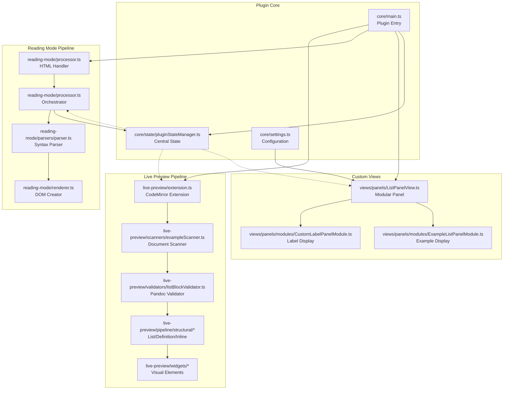
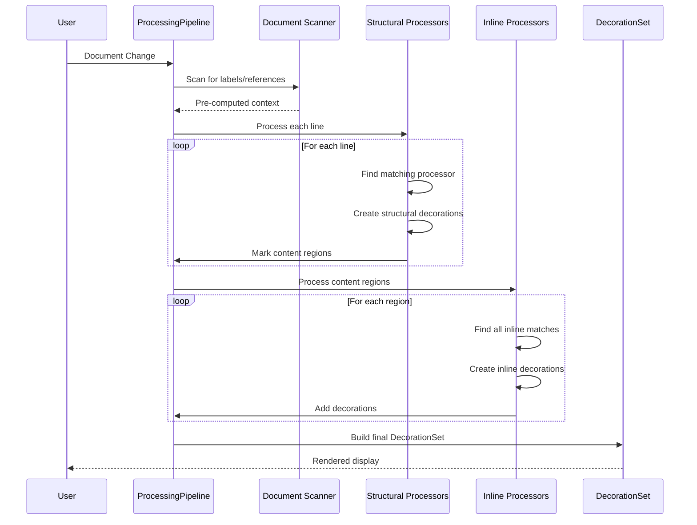
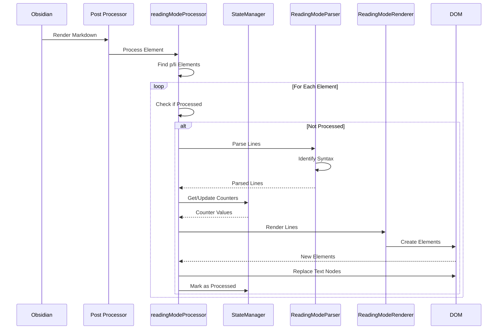
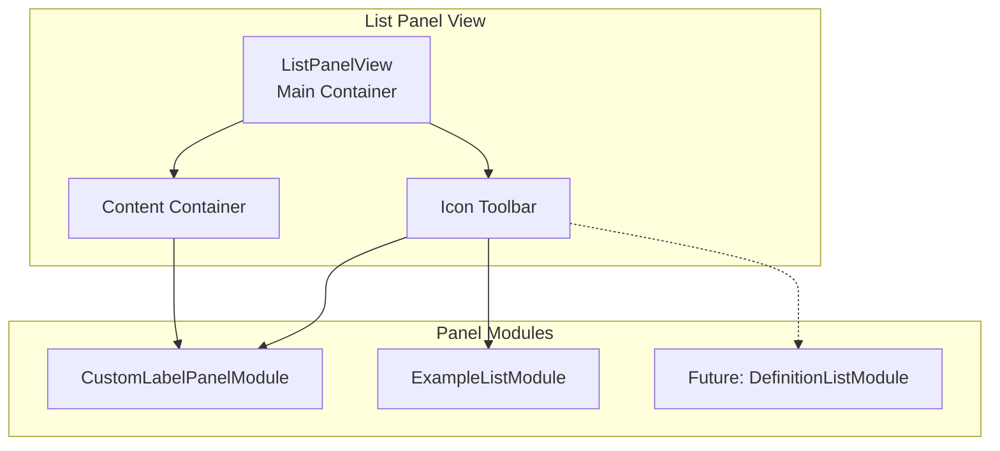
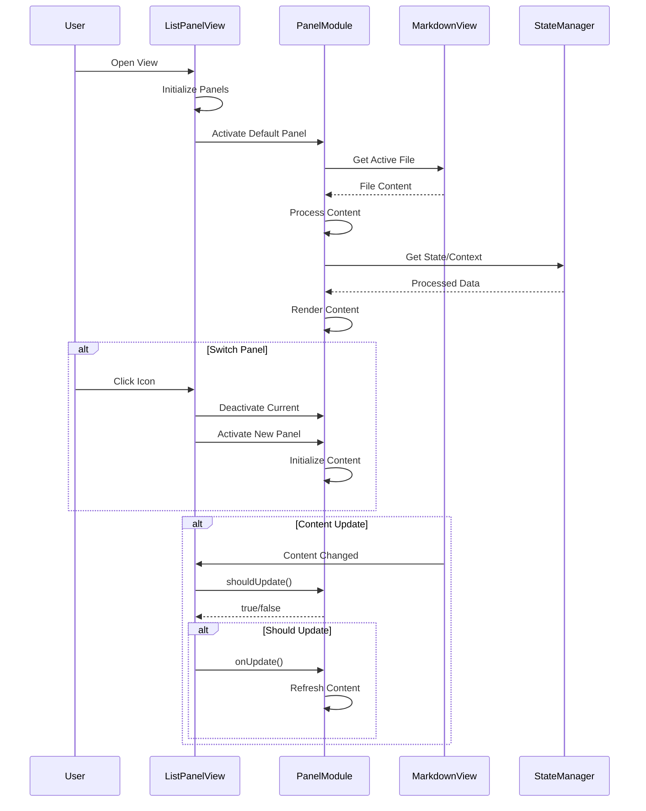
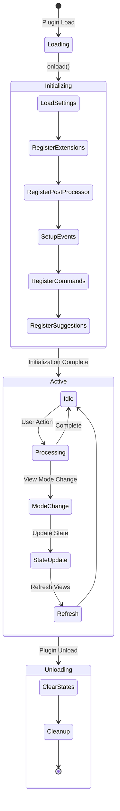
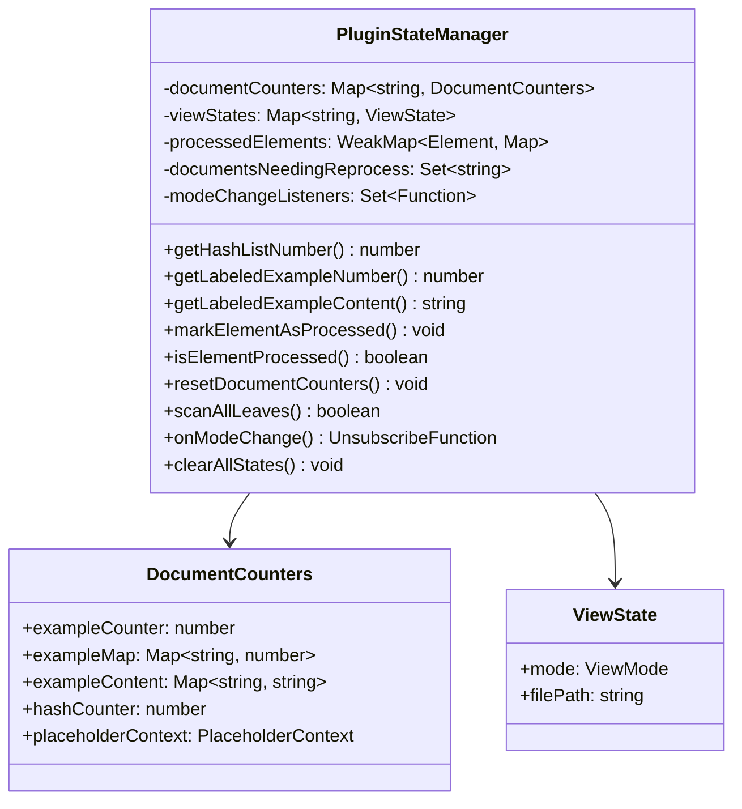
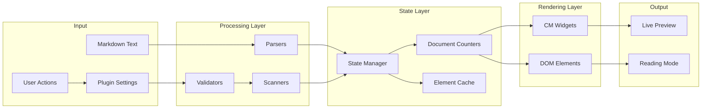

# Pandoc Extended Markdown Plugin Architecture

This document provides a comprehensive technical overview of the pandoc-extended-markdown-plugin architecture. It details the rendering pipelines, state management, and component interactions to facilitate debugging and feature development.


## Table of Contents

1. [Current Implementation Status](#current-implementation-status-v140)
2. [Project Structure](#project-structure)
3. [Architecture Overview](#architecture-overview)
4. [Two-Phase Processing Pipeline](#two-phase-processing-pipeline-active-default)
5. [Live Preview Rendering Pipeline](#live-preview-rendering-pipeline)
6. [Reading Mode Rendering Pipeline](#reading-mode-rendering-pipeline)
7. [List Panel View](#list-panel-view)
8. [Plugin Lifecycle & State Management](#plugin-lifecycle--state-management)
9. [Data Flow Diagrams](#data-flow-diagrams)
10. [Component Responsibilities](#component-responsibilities)
11. [Development Guidelines](#development-guidelines)

## Project Structure

```
pandoc-lists-plugin/
├── src/
│   ├── core/                         # Core plugin functionality
│   │   ├── main.ts                  # Plugin entry point
│   │   ├── settings.ts              # Settings management
│   │   ├── constants.ts             # Shared constants
│   │   └── state/                   # State management
│   │       └── pluginStateManager.ts
│   │
│   ├── live-preview/                # Live Preview Mode (CodeMirror)
│   │   ├── extension.ts             # Main CodeMirror extension
│   │   ├── pipeline/                # Two-phase processing pipeline
│   │   │   ├── ProcessingPipeline.ts
│   │   │   ├── types.ts
│   │   │   ├── structural/          # Phase 1: Block-level processors
│   │   │   │   ├── index.ts
│   │   │   │   ├── StandardListProcessor.ts
│   │   │   │   ├── HashListProcessor.ts
│   │   │   │   ├── FancyListProcessor.ts
│   │   │   │   ├── ExampleListProcessor.ts
│   │   │   │   ├── CustomLabelProcessor.ts
│   │   │   │   └── DefinitionProcessor.ts
│   │   │   ├── inline/              # Phase 2: Inline processors
│   │   │   │   ├── index.ts
│   │   │   │   ├── ExampleReferenceProcessor.ts
│   │   │   │   ├── CustomLabelReferenceProcessor.ts
│   │   │   │   ├── SuperscriptProcessor.ts
│   │   │   │   └── SubscriptProcessor.ts
│   │   │   └── utils/               # Pipeline utilities
│   │   │       └── codeDetection.ts # Code block/inline detection
│   │   ├── widgets/                 # CodeMirror widgets
│   │   │   ├── index.ts
│   │   │   ├── listWidgets.ts
│   │   │   ├── definitionWidget.ts
│   │   │   ├── customLabelWidget.ts
│   │   │   ├── referenceWidget.ts
│   │   │   └── formatWidgets.ts
│   │   ├── scanners/                # Document scanners
│   │   │   ├── exampleScanner.ts
│   │   │   └── customLabelScanner.ts
│   │   └── validators/              # Block validators
│   │       └── listBlockValidator.ts
│   │
│   ├── reading-mode/                # Reading Mode (Post-processing)
│   │   ├── processor.ts             # Main processor
│   │   ├── renderer.ts              # DOM renderer
│   │   └── parsers/                 # Syntax parsers
│   │       ├── parser.ts            # Main parser
│   │       ├── fancyListParser.ts
│   │       ├── exampleListParser.ts
│   │       ├── definitionListParser.ts
│   │       ├── customLabelListParser.ts
│   │       └── superSubParser.ts
│   │
│   ├── editor-extensions/           # Editor enhancements
│   │   ├── listAutocompletion.ts   # Key bindings
│   │   ├── pandocValidator.ts      # Format validation
│   │   └── suggestions/             # Autocomplete
│   │       ├── exampleReferenceSuggest.ts
│   │       └── customLabelReferenceSuggest.ts
│   │
│   ├── views/                       # UI Components
│   │   ├── panels/                  # Panel system
│   │   │   ├── ListPanelView.ts
│   │   │   ├── modules/             # Panel modules
│   │   │   │   ├── PanelTypes.ts
│   │   │   │   ├── CustomLabelPanelModule.ts
│   │   │   │   └── ExampleListPanelModule.ts
│   │   │   └── utils/               # Panel utilities
│   │   │       ├── contentTruncator.ts
│   │   │       └── viewInteractions.ts
│   │   └── editor/                  # Editor utilities
│   │       └── highlightUtils.ts
│   │
│   └── shared/                      # Shared across modes
│       ├── patterns.ts              # Regex patterns
│       ├── types/                   # Type definitions
│       │   ├── codeTypes.ts        # Code region types
│       │   ├── decorationTypes.ts  # Decoration type definitions
│       │   ├── listTypes.ts        # List-specific types
│       │   ├── obsidian-extended.ts # Extended Obsidian types
│       │   ├── processorConfig.ts  # Processor configuration types
│       │   └── settingsTypes.ts    # Settings type definitions
│       ├── extractors/              # Content extractors
│       │   ├── customLabelExtractor.ts
│       │   └── exampleListExtractor.ts
│       ├── rendering/               # Content rendering utilities
│       │   ├── ContentProcessorRegistry.ts
│       │   └── processors/
│       │       └── WikiLinkProcessor.example.ts
│       └── utils/                   # General utilities
│           ├── errorHandler.ts     # Centralized error handling
│           ├── hoverPopovers.ts    # Hover preview functionality
│           ├── listHelpers.ts      # List manipulation helpers
│           ├── listMarkerDetector.ts # List marker detection
│           ├── listRenumbering.ts  # List renumbering logic
│           ├── mathRenderer.ts     # LaTeX to Unicode conversion
│           └── placeholderProcessor.ts # Placeholder processing
│
├── __mocks__/                            # Jest mock implementations
│   ├── obsidian.ts                      # Mocks Obsidian API for testing
│   └── codemirror.ts                    # Mocks CodeMirror modules for testing
├── tests/                                # Test files -- see tests/README.md for further details
├── .github/                              # GitHub specific files
│   └── workflows/
│       └── release.yml                  # GitHub Actions workflow for automated releases
├── main.js                              # Compiled plugin code (build output)
├── manifest.json                         # Plugin metadata (id, name, version, minAppVersion)
├── versions.json                         # Version compatibility mapping for updates
├── styles.css                            # Main plugin styles for all list types
├── package.json                          # Node.js dependencies and scripts
├── tsconfig.json                         # TypeScript compiler configuration
├── jest.config.js                        # Jest testing framework configuration
├── esbuild.config.mjs                    # Build configuration for bundling the plugin
├── .gitignore                            # Specifies files to exclude from version control
├── LICENSE                               # MIT License file
├── README.md                             # User documentation
└── ARCHITECTURE.md                       # This technical documentation
```

## Architecture Overview

The plugin operates in two distinct rendering modes:

1. **Live Preview Mode**: Real-time syntax transformation using CodeMirror 6 decorations
   - Uses Two-Phase Pipeline by default (structural → inline processing)
2. **Reading Mode**: Post-processing of rendered HTML using DOM manipulation
   - Unchanged, uses specialized parsers and renderers

Both modes share a common state management system through `PluginStateManager`.

Additionally, the plugin provides a **List Panel View** - a modular sidebar panel with an icon toolbar that can display different types of list-related content. Currently supports:
- **Custom Label Panel**: Displays all custom label lists from the current document in an organized, interactive format (only available when "Custom Label List" setting is enabled)
- **Example List Panel**: Displays all example lists with their numbers, labels, and content in a three-column layout (always available)



## Two-Phase Processing Pipeline (Active Default)

### Overview
The new two-phase processing pipeline is the default rendering system as of v1.4.0. It cleanly separates structural (block-level) processing from inline content processing. The pipeline is orchestrated by `src/live-preview/pipeline/ProcessingPipeline.ts` and processes documents in two distinct phases.

### Architecture Benefits

1. **Clean Separation of Concerns**: Structural processors handle list markers and block structures, while inline processors handle references and formatting
2. **No Code Duplication**: Inline processors automatically work across all list types
3. **Easy Extensibility**: New syntax types can be added by creating and registering new processors
4. **Consistent Processing**: All content regions are processed by the same inline processors
5. **Better Testing**: Each processor can be tested independently
6. **Cursor-Aware Rendering**: Processors can adapt their output based on cursor position
7. **Unified Context**: Single context object flows through entire pipeline with all necessary data

### Pipeline Phases

#### Phase 1: Structural Processing
Identifies and decorates block-level structures (list markers, definition terms, etc.)

```typescript
interface StructuralProcessor {
    name: string;
    priority: number; // Lower numbers process first
    canProcess(line: Line, context: ProcessingContext): boolean;
    process(line: Line, context: ProcessingContext): StructuralResult;
}
```

**Registered Structural Processors (in `initializePipeline()`):**
- `HashListProcessor` (priority: 10) - Handles `#.` auto-numbered lists
- `FancyListProcessor` (priority: 20) - Handles `A.`, `i.`, `(a)` style lists  
- `ExampleListProcessor` (priority: 30) - Handles `(@label)` example lists with duplicate detection
- `CustomLabelProcessor` (priority: 15) - Handles `{::LABEL}` custom label lists with three-level display
- `DefinitionProcessor` (priority: 20) - Handles `:` and `~` definition lists with state tracking
- `ListContinuationProcessor` (priority: 100) - Handles continuation lines within lists (indented content without markers)

#### Phase 2: Inline Processing
Processes content within marked regions for references and inline formatting

```typescript
interface InlineProcessor {
    name: string;
    priority: number;
    supportedRegions: Set<string>; // Which content types to process
    findMatches(text: string, region: ContentRegion, context: ProcessingContext): InlineMatch[];
    createDecoration(match: InlineMatch, context: ProcessingContext): Decoration;
}
```

**Registered Inline Processors (in `initializePipeline()`):**
- `ExampleReferenceProcessor` (priority: 10) - Processes `(@references)` with tooltips
- `CustomLabelReferenceProcessor` (priority: 40) - Processes `{::references}` with validation
- `SuperscriptProcessor` (priority: 20) - Processes `^superscripts^` with escaped space support
- `SubscriptProcessor` (priority: 20) - Processes `~subscripts~` with escaped space support

### Detailed Processing Flow

#### Context Creation
1. **Code Region Detection**: Identify code blocks and inline code regions to skip
2. **Document Scanning**: Pre-scan for example labels and custom labels (skipping code regions)
3. **Validation**: Check strict mode constraints and invalid blocks
4. **State Management**: Retrieve placeholder context from state manager
5. **Context Building**: Assemble unified `ProcessingContext` with all data including code regions

#### Phase 1: Structural Processing
1. **Line Iteration**: Process each line sequentially
2. **Code Region Check**: Skip lines entirely within code blocks
3. **Processor Matching**: Find first processor that can handle the line
4. **Decoration Creation**: Generate structural decorations (markers, brackets)
5. **Region Marking**: Mark content regions for phase 2 processing
6. **State Updates**: Update counters and definition state

#### Phase 2: Inline Processing  
1. **Region Iteration**: Process each marked content region
2. **Match Collection**: All processors find matches in parallel
3. **Code Region Filtering**: Exclude matches that overlap with code regions
4. **Overlap Resolution**: Sort and filter overlapping matches
5. **Decoration Creation**: Generate inline decorations (references, formatting)
6. **Position Validation**: Ensure decorations are within document bounds

### Processing Flow Diagram



### Implementation Details

#### Key Classes and Files

1. **ProcessingPipeline** (`src/live-preview/pipeline/ProcessingPipeline.ts`)
   - Main orchestrator for two-phase processing
   - Manages processor registration and execution order
   - Handles context creation with document scanning
   - Builds final decoration set with bounds checking
   - Contains embedded example scanning logic (lines 19-90)

2. **Structural Processors** (`src/live-preview/pipeline/structural/`)
   - Each implements `StructuralProcessor` interface
   - Return `StructuralResult` with decorations and content regions
   - Can request to skip further processing with `skipFurtherProcessing`
   - CustomLabelProcessor has complex three-level display logic

3. **Inline Processors** (`src/live-preview/pipeline/inline/`)
   - Each implements `InlineProcessor` interface
   - Specify supported region types via `supportedRegions`
   - Return arrays of `InlineMatch` objects
   - Handle cursor awareness to avoid replacing text being edited

#### Context Data Flow

The `ProcessingContext` carries:
- **Document data**: Text, view, settings
- **Scan results**: Example labels, custom labels, duplicates
- **Validation data**: Invalid lines from strict mode
- **State tracking**: Hash counter, definition state
- **Processing artifacts**: Content regions, decorations
- **External references**: App instance, component for lifecycle

### Adding New Syntax Support

To add a new syntax type:

1. **For Structural Syntax** (list markers, block structures):
```typescript
class NewListProcessor implements StructuralProcessor {
    name = 'new-list';
    priority = 25; // Determines processing order
    
    canProcess(line: Line, context: ProcessingContext): boolean {
        // Check if this line matches your syntax
    }
    
    process(line: Line, context: ProcessingContext): StructuralResult {
        // Create decorations and mark content region
        return {
            decorations: [...],
            contentRegion: { from, to, type: 'list-content' },
            skipFurtherProcessing: true
        };
    }
}
```

2. **For Inline Syntax** (references, formatting):
```typescript
class NewReferenceProcessor implements InlineProcessor {
    name = 'new-reference';
    priority = 15;
    supportedRegions = new Set(['list-content', 'definition-content']);
    
    findMatches(text: string, region: ContentRegion, context: ProcessingContext) {
        // Find your syntax pattern
        // Check cursor position to avoid replacing during editing
    }
    
    createDecoration(match: InlineMatch, context: ProcessingContext) {
        // Create widget or mark decoration
    }
}
```

3. **Register in** `src/live-preview/extension.ts`:
```typescript
private initializePipeline(getApp?: () => any, getComponent?: () => any): void {
    // ... existing processors ...
    this.pipeline.registerStructuralProcessor(new NewListProcessor());
    this.pipeline.registerInlineProcessor(new NewReferenceProcessor());
}
```

### Content Processing for Panels and Hover Previews

The plugin uses an extensible content processing system for rendering references in panels and hover previews:

#### ContentProcessorRegistry
Located in `src/shared/rendering/ContentProcessorRegistry.ts`, this singleton registry manages content processors that transform text containing references.

**Adding a new inline syntax processor:**
```typescript
// Define your processor
const myProcessor: ContentProcessor = {
    id: 'my-syntax',
    process: (content: string, context: ProcessingContext): string => {
        // Transform content
        return content.replace(/pattern/, 'replacement');
    }
};

// Register it
ContentProcessorRegistry.getInstance().registerProcessor(myProcessor);
```

**Built-in processors:**
- `example-references`: Transforms `(@label)` to `(number)`
- `custom-label-references`: Transforms `{::label}` to processed label

See `src/shared/rendering/processors/WikiLinkProcessor.example.ts` for a complete example.

### Future Migration Path to Unified Rendering Pipeline

To achieve maximum extensibility and code reuse, the codebase could be migrated to use the `ContentProcessorRegistry` across all rendering contexts (Live Preview, Reading Mode, and Panels). Here's the proposed migration path:

#### Phase 1: Extract Inline Processors (Current State)
- ✅ Panel content processing uses `ContentProcessorRegistry`
- ✅ Hover previews use `ContentProcessorRegistry`
- Live Preview and Reading Mode still use separate implementations

#### Phase 2: Unify Inline Processing Logic
1. **Extract processing logic from Live Preview processors**:
   ```typescript
   // Current: src/live-preview/pipeline/inline/ExampleReferenceProcessor.ts
   class ExampleReferenceProcessor implements InlineProcessor {
       // CodeMirror-specific implementation
   }
   
   // Future: Create shared processor
   class SharedExampleReferenceProcessor implements ContentProcessor {
       id = 'example-references';
       process(content: string, context: ProcessingContext): string {
           // Pure transformation logic
       }
   }
   ```

2. **Adapter pattern for CodeMirror**:
   ```typescript
   class CodeMirrorProcessorAdapter implements InlineProcessor {
       constructor(private contentProcessor: ContentProcessor) {}
       
       findMatches(text: string, region: ContentRegion, context: ProcessingContext) {
           // Use contentProcessor.process() to identify matches
           // Convert to CodeMirror decorations
       }
   }
   ```

3. **Register shared processors**:
   ```typescript
   // In plugin onload()
   const sharedProcessor = new SharedExampleReferenceProcessor();
   
   // Register for panels/hovers
   ContentProcessorRegistry.getInstance().registerProcessor(sharedProcessor);
   
   // Adapt for Live Preview
   pipeline.registerInlineProcessor(new CodeMirrorProcessorAdapter(sharedProcessor));
   ```

#### Phase 3: Unify Reading Mode Processing
1. **Migrate Reading Mode parsers** to use `ContentProcessorRegistry`:
   ```typescript
   // Instead of separate parsers, use registry
   class ReadingModeProcessor {
       processElement(el: HTMLElement) {
           const text = el.textContent;
           const processed = ContentProcessorRegistry.getInstance()
               .processContent(text, this.buildContext());
           // Update DOM with processed content
       }
   }
   ```

2. **Benefits**:
   - Single source of truth for processing logic
   - New syntax automatically works in all contexts
   - Easier testing (test the processor once)
   - Better separation of concerns

#### Phase 4: Advanced Features
1. **Processor priorities** for ordering:
   ```typescript
   interface ContentProcessor {
       id: string;
       priority?: number; // Process in priority order
       process(content: string, context: ProcessingContext): string;
   }
   ```

2. **Processor dependencies**:
   ```typescript
   interface ContentProcessor {
       id: string;
       dependencies?: string[]; // Must run after these processors
       process(content: string, context: ProcessingContext): string;
   }
   ```

3. **Two-phase processing** (structural + inline):
   ```typescript
   class UnifiedPipeline {
       structuralProcessors: ContentProcessor[];
       inlineProcessors: ContentProcessor[];
       
       process(content: string): string {
           // Phase 1: Structural
           let result = this.processStructural(content);
           // Phase 2: Inline
           return this.processInline(result);
       }
   }
   ```

#### Migration Benefits
- **Code Reuse**: Write once, use everywhere
- **Consistency**: Same processing logic across all views
- **Extensibility**: Add new syntax in one place
- **Maintainability**: Single codebase to maintain
- **Testing**: Test processors in isolation

#### Implementation Order
1. Start with new syntax (easiest)
2. Migrate simple inline processors (medium)
3. Migrate complex structural processors (harder)
4. Unify Reading Mode (most complex)

This migration can be done incrementally without breaking existing functionality, allowing for gradual improvement of the architecture.

## Reading Mode Rendering Pipeline

### Overview
The reading mode system post-processes HTML after Obsidian's markdown renderer, transforming Pandoc syntax that wasn't handled by the default parser.

### Detailed Flow



### Key Components

#### 1. readingModeProcessor (Orchestrator)
- **Location**: `src/reading-mode/processor.ts`
- **Role**: Coordinates parsing, state management, and rendering
- **Process**:
  1. Selects paragraph and list item elements
  2. Validates against markdown source
  3. Prevents duplicate processing
  4. Manages render context creation

#### 2. ReadingModeParser
- **Location**: `src/reading-mode/parsers/parser.ts`
- **Purpose**: Identifies and parses Pandoc syntax
- **Capabilities**:
  - Line-by-line parsing with context awareness
  - Multiple syntax type detection
  - Metadata extraction for each syntax type

#### 3. Specialized Parsers
Each parser handles specific syntax patterns:
- **fancyListParser**: Alphabetic and roman numeral lists
- **exampleListParser**: Example lists with labels
- **definitionListParser**: Definition terms and items
- **superSubParser**: Superscript and subscript formatting
- **customLabelListParser**: 
  - Custom label lists with {::LABEL} syntax
  - Two-pass processing: scans all labels first to build context, then processes elements
  - Handles multi-placeholder references like P(#a),(#b)

#### 4. ReadingModeRenderer
- **Location**: `src/reading-mode/renderer.ts`
- **Purpose**: Creates DOM elements from parsed data
- **Features**:
  - Maintains line breaks and formatting
  - Adds tooltips for references
  - Handles nested markdown in definitions

## List Panel View

### Overview
The List Panel View provides a modular, extensible sidebar panel system for displaying various list-related content. It features an icon toolbar for switching between different panel modules and is designed to accommodate future expansion with additional list types. Panels can be conditionally registered based on plugin settings. The order of panels in the icon toolbar can be customized through the plugin settings.

### Architecture

#### Modular Design
The view follows a plugin architecture pattern:

```typescript
interface PanelModule {
    id: string;
    displayName: string;
    icon: string;  // SVG icon content
    isActive: boolean;
    
    onActivate(containerEl: HTMLElement, activeView: MarkdownView | null): void;
    onDeactivate(): void;
    onUpdate(activeView: MarkdownView | null): void;
    shouldUpdate(): boolean;
    destroy(): void;
}
```

#### Component Structure



### Adding New Panel Modules

To add a new panel module:

1. **Create Module Class**: Implement `PanelModule` interface
   ```typescript
   export class ExampleListPanelModule implements PanelModule {
       id = 'example-lists';
       displayName = 'Example Lists';
       icon = ICONS.EXAMPLE_LIST_SVG;
       // ... implement required methods
   }
   ```

2. **Register in ListPanelView**: Add to `initializePanels()`
   ```typescript
   private initializePanels(): void {
       // Register panel conditionally if needed
       const exampleListModule = new ExampleListPanelModule(this.plugin);
       availablePanels.push({
           id: exampleListModule.id,
           displayName: exampleListModule.displayName,
           icon: exampleListModule.icon,
           module: exampleListModule
       });
       
       // Panels are sorted according to user-configured order
   }
   ```

3. **Module Lifecycle**:
   - `onActivate()`: Called when user clicks the module's icon
   - `onUpdate()`: Called when document changes or view updates
   - `onDeactivate()`: Called when switching to another module
   - `destroy()`: Cleanup when view closes

### Implementation Example: Custom Label Panel

The Custom Label Panel displays all custom label lists (`{::LABEL}` syntax) from the active markdown document.

### Features
- **Two-column layout**: Displays processed labels and their rendered content
- **Smart truncation**: 
  - Labels limited to 6 characters
  - Content limited to 51 rendered characters (math-aware)
  - Math formulas are truncated based on their rendered length, not raw LaTeX length
  - Preserves valid LaTeX syntax when truncating (no trailing spaces before $)
- **Interactive elements**:
  - Label click: Copies raw label syntax to clipboard
  - Content click: Navigates to label position in editor with visual highlight
  - Hover previews: Shows full content with rendered math (only when truncated)
- **Label processing**: Replaces placeholders (#a) with numbers, shows processed form
- **Content rendering**: Displays fully rendered text with processed references and math
- **Auto-refresh**: Updates when switching files or editing content
- **Error boundaries**: Safe operation with fallback for errors

### View Interaction Flow



### Key Implementation Details

- **`extractCustomLabels()`**: Parses document for custom label syntax and processes placeholders (uses `src/shared/extractors/customLabelExtractor.ts`)
- **`renderLabels()`**: Creates DOM structure with interactive elements
- **`updateContent()`**: Updates panel when active file changes
- **Availability**: Only registered when `moreExtendedSyntax` setting is enabled
- **Truncation utilities** (in `src/views/panels/utils/contentTruncator.ts`):
  - `truncateLabel()`: Truncates labels to 6 characters
  - `truncateContent()`: Simple truncation to 51 characters
  - `truncateContentWithRendering()`: Smart truncation considering rendered math length
- **Math rendering utilities** (in `src/shared/utils/mathRenderer.ts`):
  - `renderMathToText()`: Converts LaTeX to Unicode
  - `tokenizeMath()`: Tokenizes LaTeX content
  - `truncateMathContent()`: Intelligently truncates LaTeX
- **Interaction handlers** (in `src/views/panels/utils/viewInteractions.ts`):
  - `setupLabelClickHandler()`: Handles label copying
  - `setupContentClickHandler()`: Handles navigation
- **Hover Previews** (in `src/shared/utils/hoverPopovers.ts`):
  - `setupRenderedHoverPreview()`: Renders markdown content in a hover preview.
  - `setupSimpleHoverPreview()`: Shows a simple text hover preview.
- **Content Processing** (in `src/shared/rendering/ContentProcessorRegistry.ts`):
  - `ContentProcessorRegistry`: Singleton registry for extensible content processors
  - `processContent()`: Processes content through all registered processors
  - Built-in processors for example references and custom label references
  - Extensible architecture allows adding new inline syntax processors

## Plugin Lifecycle & State Management

### Current Known Issues

1. **Duplicate Scanning**: Example labels are scanned twice (in scanner and pipeline)
2. **Context Size**: ProcessingContext has grown large with many optional fields
3. **Helper Methods**: ProcessingPipeline contains many helper methods that could be extracted

### Lifecycle Sequence



### PluginStateManager Architecture

The central state management system maintains consistency across all plugin operations:



### State Management Features

#### Document-Specific State
- Isolated counters per document
- Label-to-number mappings for cross-references
- Content caching for tooltips
- Reprocessing flags for efficient updates
- PlaceholderContext persistence across mode switches

#### View Mode Tracking
- Per-leaf mode detection (reading/live/source)
- Mode transition detection
- Event notification system
- Batch processing optimization

#### Memory Management
- WeakMap for automatic garbage collection
- Explicit cleanup on unload
- Lazy initialization of counters
- Strategic state clearing on mode changes

## Data Flow Diagrams

### Overall Data Flow



## Component Responsibilities

### Core Components

| Component | Primary Responsibility | Key Interfaces |
|-----------|----------------------|----------------|
| `main.ts` | Plugin lifecycle management | `onload()`, `onunload()`, event registration |
| `pluginStateManager` | Centralized state coordination | Counter management, mode tracking, event dispatch |
| `settings.ts` | User configuration | Settings UI, panel order configuration, preference persistence |
| `pandocValidator.ts` | Pandoc compliance validation | Format checking, auto-formatting |
| `listAutocompletion.ts` | Smart list continuation | Enter/Tab/Shift-Tab key handling, uses utility modules |
| `ListPanelView.ts` | Modular sidebar panel system | Panel management, icon toolbar, content switching |
| `PanelTypes.ts` | Panel module interfaces | Type definitions for extensible panel system |
| `CustomLabelPanelModule.ts` | Custom label panel implementation | Label display, navigation, clipboard operations |
| `ExampleListPanelModule.ts` | Example list panel implementation | Three-column display with numbers, labels, and content |


### Live Preview Components

| Component | Responsibility | Status | Input | Output |
|-----------|---------------|--------|-------|--------|
| `extension.ts` | Pipeline selection & orchestration | Active | ViewUpdate events | Decorations |
| `ProcessingPipeline.ts` | Two-phase processing coordination | Active | View, settings | DecorationSet |
| `structural/*` | Phase 1: Block-level processing | Active | Line, context | Structural decorations |
| `inline/*` | Phase 2: Inline content processing | Active | Content regions | Inline decorations |
| `scanners/exampleScanner.ts` | Example label preprocessing | Active | Document text | Label mappings |
| `scanners/customLabelScanner.ts` | Custom label preprocessing | Active | Document text | Label mappings |
| `validators/listBlockValidator.ts` | Strict mode validation | Active | Document lines | Invalid line set |
| `widgets/*` | Visual rendering | Active | Widget data | DOM elements |

### Reading Mode Components

| Component | Responsibility | Input | Output |
|-----------|---------------|-------|--------|
| `processor.ts` | Orchestration | HTML elements | Modified DOM |
| `parser.ts` | Syntax identification | Text content | Parsed lines |
| `*Parser` (specialized) | Pattern matching | Line text | Structured data |
| `renderer.ts` | DOM generation | Parsed data | HTML elements |
