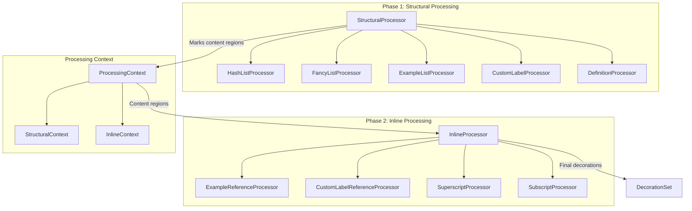

# Improved Pipeline Architecture Proposal

## Executive Summary

This proposal addresses the current limitation where each list processor must individually handle cross-references and inline formats, leading to code duplication and limited extensibility. The proposed architecture introduces a **two-phase processing pipeline** with composable processors that cleanly separates structural (block-level) processing from inline content processing.

## Current Architecture Problems

### 1. Code Duplication
Every list processor (hash, fancy, example, custom label) contains similar code for processing inline formats:
```typescript
// This pattern is repeated in EVERY list processor
const exampleRefs = processExampleReferences(inlineContext);
decorations.push(...exampleRefs);

const superscripts = processSuperscripts(inlineContext);
decorations.push(...superscripts);

const subscripts = processSubscripts(inlineContext);
decorations.push(...subscripts);
```

### 2. Tight Coupling
List processors are tightly coupled to specific inline processors. Adding a new inline format requires modifying every list processor.

### 3. Inconsistent Processing
Different processors handle the same inline formats with slight variations, leading to bugs like the one we just fixed where example references weren't processed in custom label lists.

### 4. Limited Extensibility
To add a new syntax that involves cross-references, developers must:
- Modify every existing list processor
- Understand the internals of each processor
- Ensure consistent implementation across all processors

## Proposed Architecture

### Core Concept: Two-Phase Processing Pipeline

```
Phase 1: Structural Processing (Block-level)
    ↓
Phase 2: Inline Processing (Content-level)
```

### Architecture Diagram



### Key Components

#### 1. ProcessingContext
Unified context that flows through the entire pipeline:
```typescript
interface ProcessingContext {
    // Document-level data
    document: Text;
    view: EditorView;
    settings: PandocExtendedMarkdownSettings;
    
    // Scanned data (pre-computed)
    exampleLabels: Map<string, number>;
    exampleContent: Map<string, string>;
    customLabels: Map<string, string>;
    placeholderContext: PlaceholderContext;
    
    // Processing metadata
    contentRegions: ContentRegion[];
    structuralDecorations: Decoration[];
    inlineDecorations: Decoration[];
}

interface ContentRegion {
    from: number;
    to: number;
    type: 'list-content' | 'definition-content' | 'paragraph' | 'normal';
    parentStructure?: 'hash-list' | 'fancy-list' | 'example-list' | 'custom-label-list' | 'definition';
    metadata?: any; // Structure-specific metadata
}
```

#### 2. Structural Processors (Phase 1)
Responsible ONLY for identifying and decorating structural elements:
```typescript
interface StructuralProcessor {
    name: string;
    priority: number; // Processing order
    
    canProcess(line: Line, context: ProcessingContext): boolean;
    process(line: Line, context: ProcessingContext): StructuralResult;
}

interface StructuralResult {
    decorations: Decoration[]; // Structural decorations only
    contentRegion?: ContentRegion; // Marks content for phase 2
    skipFurtherProcessing?: boolean;
}
```

Example implementation:
```typescript
class HashListProcessor implements StructuralProcessor {
    name = 'hash-list';
    priority = 10;
    
    canProcess(line: Line, context: ProcessingContext): boolean {
        return ListPatterns.isHashList(line.text);
    }
    
    process(line: Line, context: ProcessingContext): StructuralResult {
        const match = ListPatterns.getHashListMatch(line.text);
        const markerEnd = line.from + match.indent.length + match.marker.length + match.space.length;
        
        // Only handle structural decoration
        const markerDecoration = Decoration.replace({
            widget: new HashListMarkerWidget(context.hashCounter.value++),
            inclusive: false
        });
        
        // Mark content region for phase 2
        const contentRegion: ContentRegion = {
            from: markerEnd,
            to: line.to,
            type: 'list-content',
            parentStructure: 'hash-list'
        };
        
        return {
            decorations: [{from: line.from, to: markerEnd, decoration: markerDecoration}],
            contentRegion,
            skipFurtherProcessing: true
        };
    }
}
```

#### 3. Inline Processors (Phase 2)
Process ONLY content within marked regions:
```typescript
interface InlineProcessor {
    name: string;
    priority: number;
    supportedRegions: Set<string>; // Which content types to process
    
    findMatches(text: string, region: ContentRegion, context: ProcessingContext): InlineMatch[];
    createDecoration(match: InlineMatch, context: ProcessingContext): Decoration;
}

interface InlineMatch {
    from: number; // Relative to region start
    to: number;
    type: string;
    data: any;
}
```

Example implementation:
```typescript
class ExampleReferenceProcessor implements InlineProcessor {
    name = 'example-reference';
    priority = 10;
    supportedRegions = new Set(['list-content', 'definition-content', 'paragraph']);
    
    findMatches(text: string, region: ContentRegion, context: ProcessingContext): InlineMatch[] {
        const matches: InlineMatch[] = [];
        const regex = /\(@([a-zA-Z][a-zA-Z0-9_-]*)\)/g;
        
        let match;
        while ((match = regex.exec(text))) {
            if (context.exampleLabels.has(match[1])) {
                matches.push({
                    from: match.index,
                    to: match.index + match[0].length,
                    type: 'example-ref',
                    data: { label: match[1] }
                });
            }
        }
        
        return matches;
    }
    
    createDecoration(match: InlineMatch, context: ProcessingContext): Decoration {
        const number = context.exampleLabels.get(match.data.label);
        const content = context.exampleContent.get(match.data.label);
        
        return Decoration.replace({
            widget: new ExampleReferenceWidget(number, content, context.view),
            inclusive: false
        });
    }
}
```

#### 4. Pipeline Orchestrator
Coordinates the two-phase processing:
```typescript
class ProcessingPipeline {
    private structuralProcessors: StructuralProcessor[] = [];
    private inlineProcessors: InlineProcessor[] = [];
    
    registerStructuralProcessor(processor: StructuralProcessor) {
        this.structuralProcessors.push(processor);
        this.structuralProcessors.sort((a, b) => a.priority - b.priority);
    }
    
    registerInlineProcessor(processor: InlineProcessor) {
        this.inlineProcessors.push(processor);
        this.inlineProcessors.sort((a, b) => a.priority - b.priority);
    }
    
    process(view: EditorView, settings: PandocExtendedMarkdownSettings): DecorationSet {
        const context = this.createContext(view, settings);
        
        // Phase 1: Structural processing
        for (const line of view.state.doc.iterLines()) {
            for (const processor of this.structuralProcessors) {
                if (processor.canProcess(line, context)) {
                    const result = processor.process(line, context);
                    context.structuralDecorations.push(...result.decorations);
                    
                    if (result.contentRegion) {
                        context.contentRegions.push(result.contentRegion);
                    }
                    
                    if (result.skipFurtherProcessing) {
                        break;
                    }
                }
            }
        }
        
        // Phase 2: Inline processing
        for (const region of context.contentRegions) {
            const text = view.state.doc.sliceString(region.from, region.to);
            
            for (const processor of this.inlineProcessors) {
                if (processor.supportedRegions.has(region.type)) {
                    const matches = processor.findMatches(text, region, context);
                    
                    for (const match of matches) {
                        const decoration = processor.createDecoration(match, context);
                        context.inlineDecorations.push({
                            from: region.from + match.from,
                            to: region.from + match.to,
                            decoration
                        });
                    }
                }
            }
        }
        
        // Combine and return decorations
        return this.buildDecorationSet(context);
    }
}
```

### Benefits of This Architecture

#### 1. Clean Separation of Concerns
- Structural processors focus on list markers, definition terms, etc.
- Inline processors focus on references, formatting, etc.
- No mixing of responsibilities

#### 2. Easy Extensibility
To add a new cross-reference type:
```typescript
// Just create and register a new inline processor
class NewReferenceProcessor implements InlineProcessor {
    // Implementation
}

pipeline.registerInlineProcessor(new NewReferenceProcessor());
// That's it! Works in ALL list types automatically
```

#### 3. Consistent Processing
All content regions are processed by the same inline processors, ensuring consistency.

#### 4. Better Performance
- Processors can be optimized independently
- Inline processors only run on content regions, not entire document
- Can parallelize phase 2 processing if needed

#### 5. Easier Testing
- Test structural processors without inline processing
- Test inline processors with mock content regions
- Clear separation makes unit testing straightforward

#### 6. Maintainability
- Changes to inline processing don't affect structural processing
- New list types automatically get all inline processing
- Clear interfaces and contracts

## Implementation Plan

### Phase 1: Core Infrastructure (Week 1)
1. Create new interfaces and base classes
2. Implement ProcessingContext and ContentRegion
3. Create ProcessingPipeline orchestrator
4. Add registration system for processors

### Phase 2: Migrate Structural Processors (Week 2)
1. Convert HashListProcessor
2. Convert FancyListProcessor
3. Convert ExampleListProcessor
4. Convert CustomLabelProcessor
5. Convert DefinitionProcessor

### Phase 3: Migrate Inline Processors (Week 3)
1. Convert ExampleReferenceProcessor
2. Convert CustomLabelReferenceProcessor
3. Convert SuperscriptProcessor
4. Convert SubscriptProcessor
5. Add new processors as needed

### Phase 4: Integration & Testing (Week 4)
1. Replace old pandocExtendedMarkdownExtension with new pipeline
2. Update all tests
3. Performance testing and optimization
4. Documentation updates

## Migration Strategy

### Backward Compatibility
1. Keep old processors during migration
2. Feature flag for new pipeline
3. A/B testing with select users
4. Gradual rollout

### Risk Mitigation
1. Comprehensive test suite before migration
2. Parallel running of old and new pipelines for validation
3. Easy rollback mechanism
4. Incremental migration (one processor at a time)

## Example: Adding Footnote References

With the new architecture, adding footnote references would be trivial:

```typescript
// 1. Create the processor
class FootnoteReferenceProcessor implements InlineProcessor {
    name = 'footnote-reference';
    priority = 15;
    supportedRegions = new Set(['list-content', 'definition-content', 'paragraph']);
    
    findMatches(text: string, region: ContentRegion, context: ProcessingContext): InlineMatch[] {
        const matches: InlineMatch[] = [];
        const regex = /\[fn:([a-zA-Z0-9_-]+)\]/g;
        
        let match;
        while ((match = regex.exec(text))) {
            matches.push({
                from: match.index,
                to: match.index + match[0].length,
                type: 'footnote-ref',
                data: { id: match[1] }
            });
        }
        
        return matches;
    }
    
    createDecoration(match: InlineMatch, context: ProcessingContext): Decoration {
        return Decoration.replace({
            widget: new FootnoteReferenceWidget(match.data.id, context),
            inclusive: false
        });
    }
}

// 2. Register it
pipeline.registerInlineProcessor(new FootnoteReferenceProcessor());

// 3. Done! Works everywhere automatically
```

## Conclusion

This proposed architecture addresses the current limitations by:
1. Eliminating code duplication
2. Decoupling structural and inline processing
3. Providing clear extension points
4. Ensuring consistent behavior across all contexts

The two-phase pipeline with registered processors provides a clean, maintainable, and extensible solution that will scale as new features are added to the plugin.