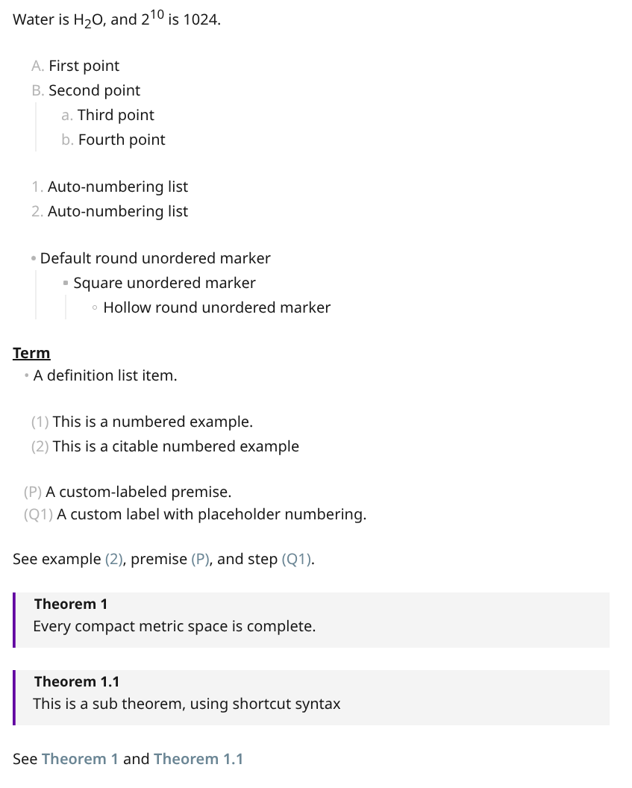

# Pandoc Extended Markdown

Pandoc Extended Markdown is an Obsidian plugin that makes common [Pandoc Markdown extensions](https://pandoc.org/MANUAL.html#pandocs-markdown) readable in Live Preview and Reading mode while preserving the original Markdown source.

It focuses on syntax that is useful while writing notes: fancy lists, definition lists, example lists, fenced divs, custom label lists, superscripts, subscripts, list editing helpers, and an optional sidebar panel for navigating structured list-like content.

## Highlights

| Feature | Example | What it does |
| --- | --- | --- |
| Superscript and subscript | `2^10^`, `H~2~O` | Renders Pandoc-style inline super/subscripts. |
| Fancy lists | `A.`, `a)`, `iv.`, `#.` | Renders alphabetic, Roman numeral, and hash auto-numbered lists. |
| Unordered list markers | `-`, `+`, `*` | Keeps `-` as the default round marker, renders `+` as a square, and renders `*` as a hollow round marker. |
| Definition lists | `Term` followed by `: definition` | Renders Pandoc definition lists in Live Preview and Reading mode. |
| Example lists | `(@label) Example` and `(@label)` | Numbers examples and resolves local example references. |
| Fenced divs | `::: {.theorem #thm title="Theorem &"}` | Renders Pandoc fenced divs with optional titles, numbering, local `@id` references, and rail-drag block moves in Live Preview. |
| Custom label lists | `{::P} Premise` | Adds custom labels, references, and placeholder numbering. |
| List editing helpers | Enter, Tab, Shift+Tab | Continues lists, cycles marker styles by depth, and can renumber affected list items. |
| List panel | Command: `Open list panel` | Shows custom labels, examples, definition lists, fenced divs, and footnotes from the active note. |

## Quick Start

Paste this into a note and switch to Live Preview.

```markdown
Water is H~2~O, and 2^10^ is 1024.

A.  First point
B.  Second point
    a. Third point
    b. Fourth point

#. Auto-numbering list
#. Auto-numbering list

- Default round unordered marker
	+ Square unordered marker
		* Hollow round unordered marker

Term
:   A definition list item.

(@) This is a numbered example.
(@intro) This is a citable numbered example

{::P} A custom-labeled premise.
{::Q(#step)} A custom label with placeholder numbering.

See example (@intro), premise {::P}, and step {::Q(#step)}.

::: {.theorem #compact title="Theorem &"}
Every compact metric space is complete.
:::

::: theorem &.& #thm2
This is a sub theorem, using shortcut syntax
:::

See @compact and @thm2

```

Preview:



## Documentation

Start here if you want more than the quick start:

- [Documentation index](docs/README.md)
- [Syntax reference](docs/syntax-reference.md)
- [Customizing CSS](docs/customizing-css.md)
- [Fenced divs](docs/fenced-divs.md)
- [List panel](docs/list-panel.md)
- [Pandoc export](docs/pandoc-export.md)
- [Development](docs/development.md)
- [Architecture](docs/architecture.md)

## Modes And Settings

- Live Preview is the main editing surface.
- Reading mode renders the implemented syntax after Obsidian has produced its HTML.
- Source mode preserves plain Markdown.
- Pandoc list lenient spacing allows list enhancements to render with looser spacing; disabling it requires Pandoc-compatible spacing.
- Readable fenced div shorthand can be disabled separately when you want source closer to native Pandoc Markdown.

The plugin settings let you enable or disable individual syntax families, list marker cycling, auto-renumbering, distinct unordered-list marker rendering, and the sidebar list panel.

## Pandoc Export

Pandoc export is an optional desktop-only module. It is disabled by default, is not loaded as a hard requirement for normal rendering, and is not available on mobile. Live Preview and Reading mode continue to work when Pandoc is missing, disabled, or unavailable.

Enable **Pandoc export** in plugin settings, optionally set a Pandoc executable path, then run **Export with pandoc** or **Export with previous pandoc settings**. Built-in profiles cover common Pandoc formats such as Markdown, HTML, PDF, DOCX, ODT, RTF, EPUB, LaTeX, Typst, PPTX, and bibliography export. The export preview selector covers Pandoc's output format list: browser-renderable formats use HTML/text previews, and PDF, DOCX, EPUB, ODT, and PPTX use bundled JavaScript renderers or the ODT fallback path.

Obsidian rendering does not automatically change Pandoc CLI output. The plugin bundles Lua filters for plugin-specific export behavior and writes them into the installed plugin folder on startup:

```bash
pandoc input.md --lua-filter=lua_filter/FencedDivExtendedSyntax.lua -o output.docx
pandoc input.md --lua-filter=lua_filter/CustomLabelList.lua -o output.docx
```

See [Pandoc export](docs/pandoc-export.md) and [Pandoc variables and Lua filters](docs/pandoc-variables-and-filters.md) for details.

## Development

```bash
npm install
npm run dev
npm run build
npm run lint
npm test
```

See [Development](docs/development.md) and [tests/README.md](tests/README.md) for repository layout and test guidance.

## Requirements

- Obsidian 1.4.0 or newer.
- Desktop and mobile are supported.

## Support

Report bugs and feature requests in [GitHub Issues](https://github.com/ErrorTzy/obsidian-pandoc-extended-markdown/issues).

## License

MIT. See [LICENSE](LICENSE).

## Author

Created by [Scott Tang](https://github.com/ErrorTzy).
